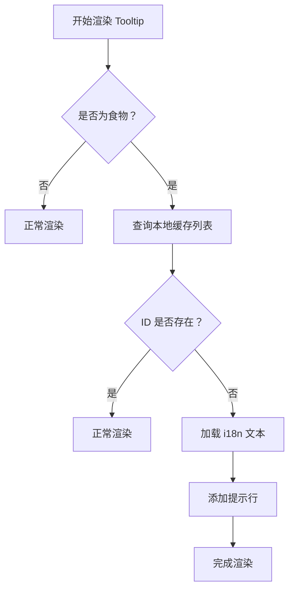
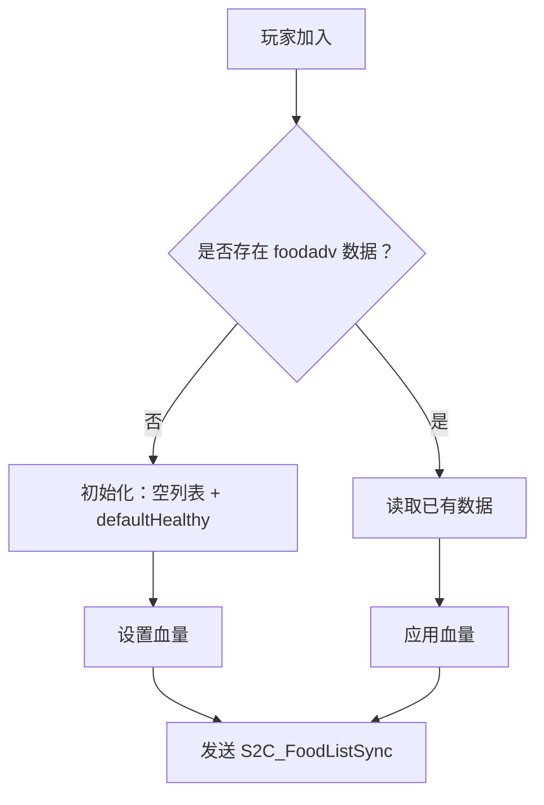
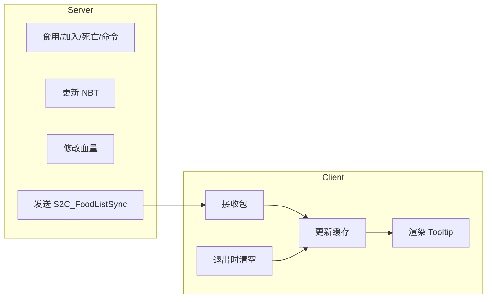

# 1 概述

> **版本：** 1.20.1
> **加载器：** Fabric
> **作者：** xianfish
> **名称：** Spice of Life:Fabric Flavor / 生活调味料：胡罗贝版
> **Mod ID：** `sol2f`
> **目标平台：** 单人游戏与多人服务器通用
> **设计定位：** 功能性生存增强模组，鼓励玩家探索食物多样性

---

## 1.1 功能概述

本模组通过“首次食用食物奖励机制”提升玩家在生存模式中的探索动力，提升整合包平衡性。

| 编号 | 功能名称                               | 所属模块 |
| ---- | -------------------------------------- | -------- |
| F1   | 首次食用奖励机制                       | 核心成长 |
| F2   | 未食用食物 Tooltip 提示                | UI 渲染  |
| F3   | 数据重置命令 `/foodadv clearhealthy` | 命令系统 |
| F4   | 死亡后是否重置进度                     | 状态策略 |
| F5   | 参数化配置系统                         | 配置管理 |
| F6   | 国际化支持（i18n）                     | 本地化   |

---

# 2 功能描述及细节

## 2.1 F1：首次食用奖励机制

### 描述

当玩家成功使用并完成一个从未食用过的可食用物品时，其最大生命值上限将永久提升。

### 细节

- 判定依据为该食物的注册名（`Registry.ITEM.getId(item).toString()`）是否已记录；
- 每种食物仅触发一次增益；
- 增益数值由配置项 `healthyGain` 控制，默认为 2 点生命值（即 +1 心）；
- 当前最大生命值不得超过 `maxHealthy` 限制，默认为 120 点（60 心）；
- 触发时机为 `UseItemCallback.EVENT.invoker().interact(...)` 完成后；
- 不区分来源（合成、掉落、种植等），只要首次食用即生效；
- 所有逻辑运行于服务端，防止客户端伪造。

---

## 2.2 F2：未食用食物 Tooltip 提示

### 描述

对于尚未被当前玩家食用的食物，在其物品描述框底部添加一条自定义提示文本。

### 细节

- 提示内容来自语言键 `foodadv.tooltip.unconsumed`；
- 示例显示：“从未食用过！” 或 “Never Eaten Before!”；
- 仅在客户端渲染阶段添加，不影响原生 Tooltip 结构；
- 使用标准 Minecraft 文本组件（`Text` API）插入；
- 推荐样式：浅黄色斜体文字，提高辨识度但不过度干扰；
- 仅对满足 `item.getFoodComponent() != null` 的物品生效；
- 已食用的食物不显示提示。

---

## 2.3 F3：数据重置命令 `/foodadv clearhealthy`

### 描述

提供一条服务器命令，用于清空指定玩家的食物记录并将其生命值重置为初始值。

### 细节

- 命令格式：
  ```
  /foodadv clearhealthy [player]
  ```
- 若省略 `[player]`，默认作用于执行者；
- 权限要求：OP 或权限等级 ≥ 2；
- 执行效果：
  - 清空该玩家 NBT 中的已食用食物列表；
  - 将其最大生命值设为 `defaultHealthy`；
  - 保存更新后的数据；
  - 向客户端发送同步包以刷新 UI；
  - 返回成功提示消息；
- 主要用途：调试、重开进度、特定玩法规则。

---

## 2.4 F4：死亡后是否重置进度

### 描述

通过配置决定玩家死亡后是否自动清空其食物记录和生命值。

### 细节

- 配置字段：`resetOnDeath`，布尔值；
- 默认值：`false`（死亡不重置）；
- 若设为 `true`：
  - 玩家死亡后立即清空 `consumed_foods` 列表；
  - 最大生命值恢复为 `defaultHealthy`；
  - 更新属性并保存 NBT；
  - 向客户端发送空列表同步包；
- 可用于实现“硬核生存”或“轮回挑战”类玩法；
- 仅影响当前玩家，不影响其他玩家。

---

## 2.5 F5：参数化配置系统

### 描述

支持 JSON 格式的外部配置文件，允许用户自定义核心参数。

### 细节

- 配置路径：`config/foodadv.json`
- 内容结构：

```json
{
  "maxHealthy": 120,
  "defaultHealthy": 20,
  "healthyGain": 2,
  "resetOnDeath": false
}
```

| 字段名             | 类型   | 默认值 | 含义                              |
| ------------------ | ------ | ------ | --------------------------------- |
| `maxHealthy`     | 整数   | 120    | 最大允许的生命值点数（60心）      |
| `defaultHealthy` | 整数   | 20     | 新玩家初始化的最大生命值（10心）  |
| `healthyGain`    | 整数   | 2      | 每种新食物带来的生命值增长（1心） |
| `resetOnDeath`   | 布尔值 | false  | 死亡后是否重置进度                |

- 加载时机：服务端启动时读取；
- 若文件缺失或字段错误，使用默认值填充；

---

## 2.6 F6：国际化支持（i18n）

### 描述

未食用食物的提示文本支持多语言翻译，适配不同语言环境。

### 细节

- 资源路径：`assets/foodadv/lang/<lang>.json`
- 关键语言键：`foodadv.tooltip.unconsumed`
- 支持标准 Minecraft 语言代码，如：
  - `zh_cn.json`
  - `en_us.json`
  - `lzh.json`
- 示例（中文）：
  ```json
  { "foodadv.tooltip.unconsumed": "看起来神秘而陌生" }
  ```
- 示例（英文）：
  ```json
  { "foodadv.tooltip.unconsumed": "Never Eaten Before" }
  ```

---

# 3 功能实现

## 3.1 F1：首次食用奖励机制

- **事件监听**：注册 `UseItemCallback.EVENT` 监听器，在物品使用完成后触发；
- **服务端判断**：获取玩家对象，检查该食物是否已在 `NBT.consumed_foods` 列表中；
- **状态更新**：
  - 若未记录，则将其 ResourceLocation 字符串加入列表；
  - 计算新最大生命值 = 当前值 + `healthyGain`；
  - 若超过 `maxHealthy`，则截断至最大值；
- **血量修改**：调用 `player.getAttributeInstance(Attributes.MAX_HEALTH).setBaseValue(newValue)`；
- **数据持久化**：将更新后的列表和最大生命值写入玩家 NBT；
- **网络同步**：构建并发送 `S2C_FoodListSync` 包至客户端。

---

## 3.2 F2：未食用食物 Tooltip 提示

- **渲染拦截**：通过 `ItemTooltipCallback` 或 mixin 注入 Tooltip 渲染流程；
- **缓存查询**：从本地内存缓存中读取当前玩家的已食用食物集合；
- **判定逻辑**：若当前物品 ID 不在缓存中，则视为“未食用”；
- **文本插入**：创建 `Text.translatable("foodadv.tooltip.unconsumed")` 并添加到底部；
- **样式设置**：应用颜色（如 `Formatting.YELLOW`）和可选斜体；
- **性能优化**：缓存避免重复解析 NBT，提升渲染效率。

---

## 3.3 F3：数据重置命令 `/foodadv clearhealthy`

- **命令注册**：使用 `CommandRegistrationCallback` 注册根命令 `/foodadv`；
- **子命令绑定**：添加子命令 `clearhealthy`，支持可选目标玩家参数；
- **权限验证**：确保执行者具有足够权限（`server.getOpPermissionLevel() <= 2`）；
- **数据清理**：
  - 清空 `NBT.foodadv.consumed_foods`；
  - 设置 `max_health = defaultHealthy`；
  - 调用属性系统更新血量；
  - 保存 NBT；
- **同步通知**：向目标玩家发送 `S2C_FoodListSync`（空列表）；
- **反馈信息**：返回 `"§a[FoodAdv] 进度已重置"` 类提示。

---

## 3.4 F4：死亡后是否重置进度

- **事件监听**：注册 `PlayerDiedCallback`；
- **条件判断**：读取配置 `resetOnDeath`；
- **执行动作**：
  - 若为 `true`，则清空 `consumed_foods` 列表；
  - 重置最大生命值为 `defaultHealthy`；
  - 更新属性并保存 NBT；
  - 发送同步包至客户端；
- **边界处理**：仅处理实际死亡事件，不响应假死或旁观模式切换。

---

## 3.5 F5：参数化配置系统

- **配置类定义**：创建 `ModConfig` 类映射 JSON 字段；
- **Gson 解析**：使用 `GsonBuilder().setPrettyPrinting()` 读取文件；
- **路径管理**：`Path configDir = FabricLoader.getInstance().getConfigDir();`；
- **默认生成**：若文件不存在，写入默认 JSON 内容；
- **异常处理**：捕获 `JsonSyntaxException` 和 IO 错误，降级使用默认值；
- **全局持有**：静态实例供其他模块调用，如 `ModConfig.INSTANCE.maxHealthy`。

---

## 3.6 F6：国际化支持（i18n）

- **资源打包**：在 `resources/assets/foodadv/lang/` 下放置各语言文件；
- **文本加载**：使用 `Text.translatable("foodadv.tooltip.unconsumed")` 创建可翻译文本；
- **运行时解析**：Minecraft 自动根据客户端语言选择对应翻译；
- **无额外依赖**：完全基于原生 i18n 机制，无需第三方库。

---

# 4 运行逻辑

## 4.1 客户端运行逻辑

### 主要职责

- 渲染带有提示的 Tooltip；
- 接收并缓存服务端推送的食物列表；
- 在退出世界时清除本地缓存；
- 不参与任何状态变更或数据存储。

### 流程图：Tooltip 渲染



### 缓存生命周期

- 初始化：接收 `S2C_FoodListSync` 包时填充；
- 使用：Tooltip 渲染时查询；
- 销毁：监听 `ClientPlayNetworkHandler.onDisconnected` 事件，在断开连接时清空。

---

## 4.2 服务端运行逻辑

### 主要职责

- 管理玩家 NBT 数据；
- 处理食物使用、死亡、命令等事件；
- 修改玩家属性；
- 向客户端发送同步包。

### 流程图：食物食用处理

```mermaid
flowchart TD
    A[使用食物完成] --> B[获取玩家 NBT]
    B --> C[提取食物 ID]
    C --> D{是否已记录？}
    D -->|是| E[结束]
    D -->|否| F[加入 consumed_foods]
    F --> G[计算 newMax = current + gain]
    G --> H{> maxHealthy?}
    H -->|是| I[newMax = maxHealthy]
    H -->|否| J[newMax = 计算值]
    I & J --> K[setBaseValue(newMax)]
    K --> L[保存 NBT]
    L --> M[发送 S2C_FoodListSync]
```

### 流程图：玩家加入处理



---

## 4.3 客户端与服务端交互逻辑

### 数据交换方式

- 使用 `ServerPlayNetworking.send(player, packet)` 发送自定义包；
- 数据包类型：`S2C_FoodListSyncPacket`，包含 `List<String>` 食物 ID；
- 序列化：通过 `PacketByteBuf.writeStringCollection()` 实现；
- 接收端：客户端注册对应处理器更新缓存。

### 通信流程图



### 为何使用缓存而非直接同步 NBT？

- 原生 NBT 同步延迟高且不可控；
- 客户端无法主动感知变化；
- 缓存+推送方案响应更快、体验更流畅；
- 会话级缓存避免跨存档数据污染。

---

# 5 要点和注意事项

1. **客户端与服务端严格分离**

   - 所有状态管理必须在服务端进行；
   - 客户端不得写入或修改核心数据；
   - 防止作弊与数据不一致。
2. **NBT 数据结构规范**

   - 使用唯一命名空间避免冲突：`foodadv:consumed_foods`, `foodadv:max_health`；
   - 存储为字符串列表而非标签嵌套，便于序列化；
   - 每次变更后必须调用 `saveNbt()` 并标记脏数据。
3. **网络包设计原则**

   - 包大小最小化，仅传输必要 ID 列表；
   - 使用可靠的 `ServerPlayNetworking` API；
   - 包名清晰：`FoodAdvPackets.S2C_SYNC_FOOD_LIST`；
   - 添加版本号字段（可选）以防未来兼容问题。
4. **血量修改安全机制**

   - 必须使用 `Attributes.MAX_HEALTH` 属性系统；
   - 禁止直接修改 `player.setHealth()` 或 `dataTracker`；
   - 保证与药水效果、附魔等系统的兼容性。
5. **缓存管理要求**

   - 缓存仅存在于内存中，不持久化；
   - 必须在 `onDisconnected` 时清空；
   - 支持多世界切换隔离（按 `ClientWorld` 实例区分）；
6. **配置文件处理**

   - 服务端独占读取，客户端忽略；
   - 提供默认值兜底；
   - 支持热重载（可选扩展）；
7. **测试建议**

   - 单人模式测试基础功能；
   - 多人服务器测试同步与缓存一致性；
   - 切换存档验证缓存清除；
   - 断线重连测试数据恢复。
8. **未来扩展方向**

   - 添加食物图鉴 GUI；
   - 成就联动（Advancement）；
   - 分阶段奖励（如每10种食物解锁特效）；
   - 支持非食物类“尝试行为”扩展。
